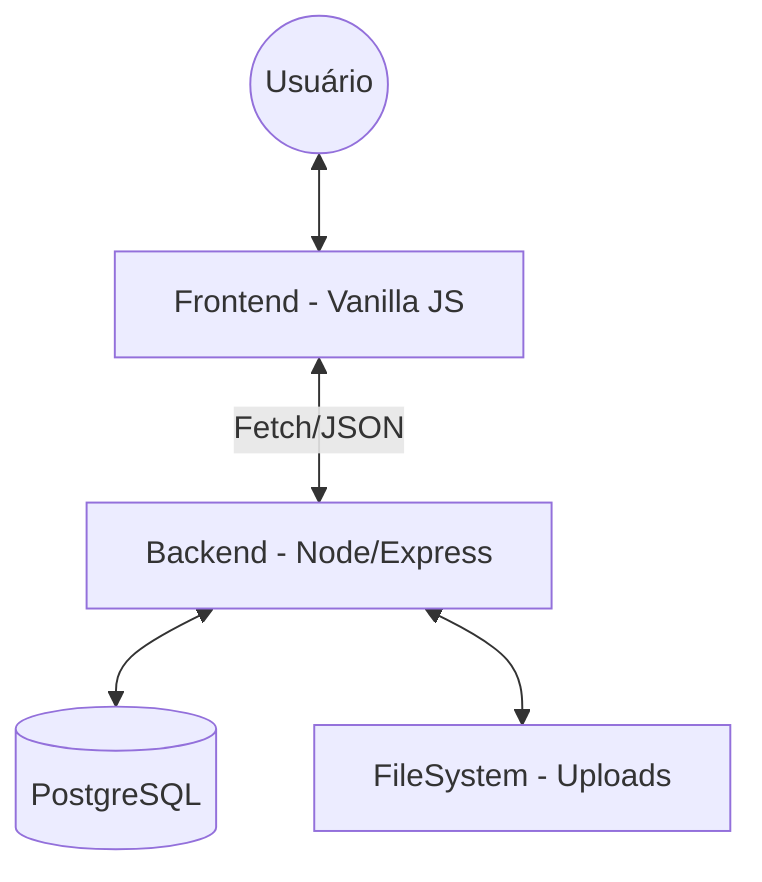
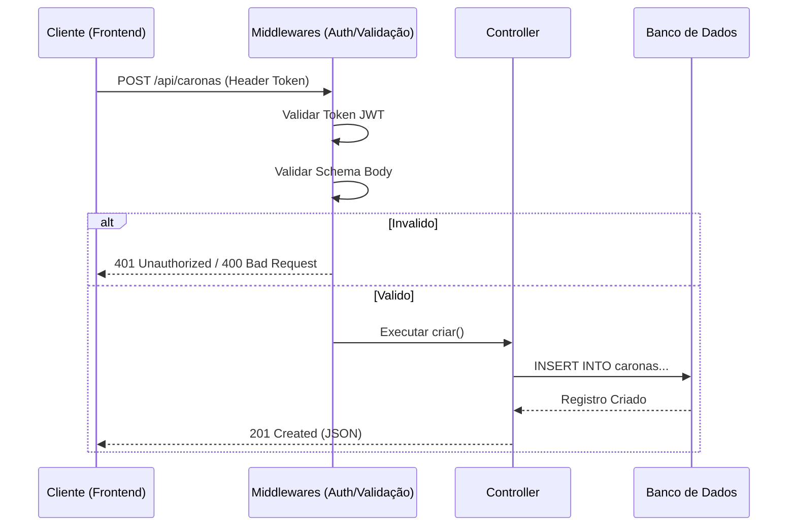

# Arquitetura do Sistema 🏗️

Este documento descreve a organização técnica, padrões de projeto e o fluxo de dados do UniCaronas.

## 1. Visão Geral
O sistema utiliza uma arquitetura de **Cliente-Servidor** baseada em uma API RESTful. O frontend é desacoplado do backend, permitindo que a lógica de negócio resida inteiramente no servidor.

## 2. Organização do Projeto

### Backend (Pasta `backend/`)
-   `server.js`: Ponto de entrada, configuração de middlewares globais e rotas.
-   `src/routes/`: Define os endpoints e associa-os a controllers e middlewares.
-   `src/controllers/`: Processa as requisições, interage com o banco e retorna respostas.
-   `src/middleware/`: Interceptores para autenticação (JWT), validação de esquema e tratamento de erros.
-   `src/services/`: Lógica pesada que pode ser compartilhada (ex: lista de espera, notificações).
-   `src/utils/`: Funções puras e utilitários (Pix, precificação).

### Frontend (Pasta `frontend/`)
-   `pages/`: Arquivos HTML representando cada tela do sistema.
-   `js/api.js`: Cliente centralizador de todas as chamadas `fetch` para o backend.
-   `js/chat-global.js` & `js/notificacoes-global.js`: Scripts de gerenciamento de estado e interface para recursos globais.
-   `css/`: Estilização modularizada.

## 3. Fluxo de uma Requisição
Toda requisição que chega ao servidor passa pelo seguinte ciclo de vida:

1.  **Transporte:** O cliente faz um `fetch` enviando JSON ou FormData.
2.  **Middlewares de Segurança:** `helmet` e `cors` validam a origem e segurança básica.
3.  **Parsing:** `express.json()` e `multer` processam o corpo da requisição.
4.  **Autenticação:** O middleware `auth.js` verifica o cabeçalho `Authorization: Bearer <token>`.
5.  **Validação:** O middleware `validacao.js` verifica se os campos obrigatórios estão presentes.
6.  **Controller:** A lógica específica é executada.
7.  **Banco de Dados:** Consultas SQL via `pg`.
8.  **Resposta:** JSON estruturado é retornado.
9.  **Error Handling:** Se ocorrer qualquer erro, o `errorHandler.js` captura e formata a resposta.

## 4. Estratégia de Autenticação
-   **Mecanismo:** JSON Web Token (JWT).
-   **Armazenamento no Cliente:** `localStorage` (através do arquivo `js/api.js`).
-   **Validade:** O token é enviado em todas as requisições protegidas.
-   **Segurança:** Senhas são armazenadas como hashes Bcrypt (salt=10).

## 5. Padrões Encontrados
-   **Singleton (Implícito):** O pool de conexão do banco de dados em `config/database.js`.
-   **Middleware Pattern:** Extensivamente usado no Express para modularizar segurança e lógica comum.
-   **Repository/DAO (Implícito):** Embora não use uma classe Repository separada, o uso de `db.query` dentro de controllers segue um padrão de persistência direto.
-   **Service Layer:** Identificada nos serviços de Notificação e Lista de Espera, isolando lógica complexa dos controllers.
