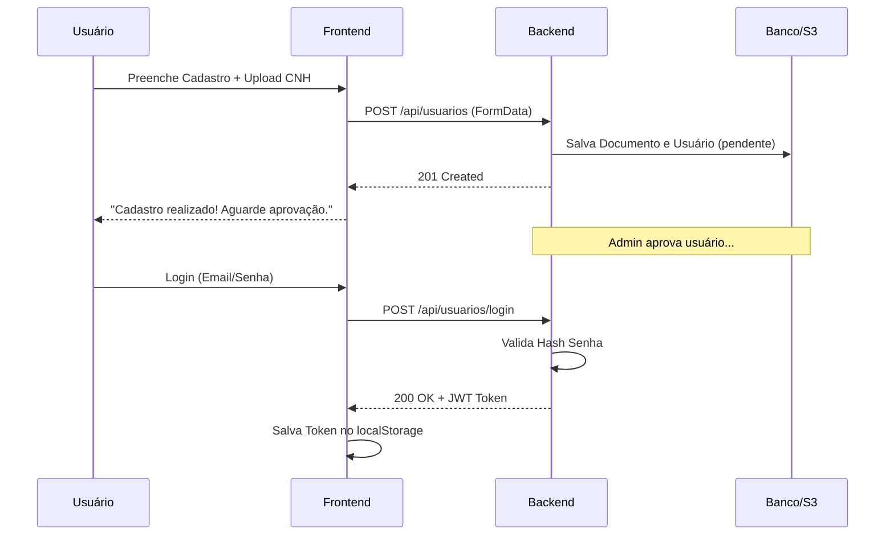
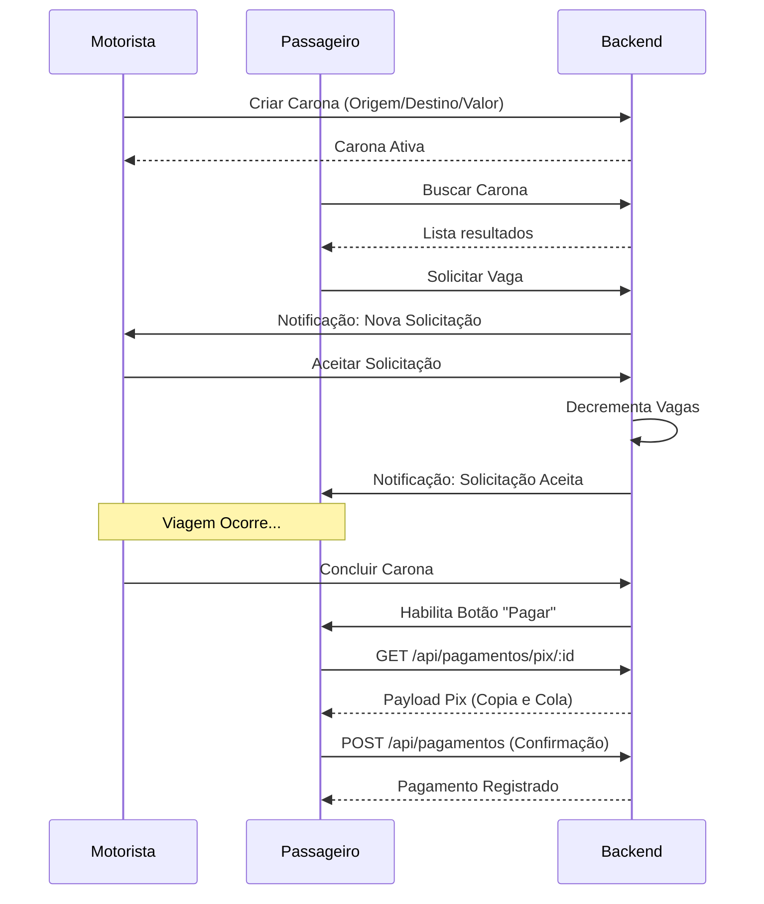
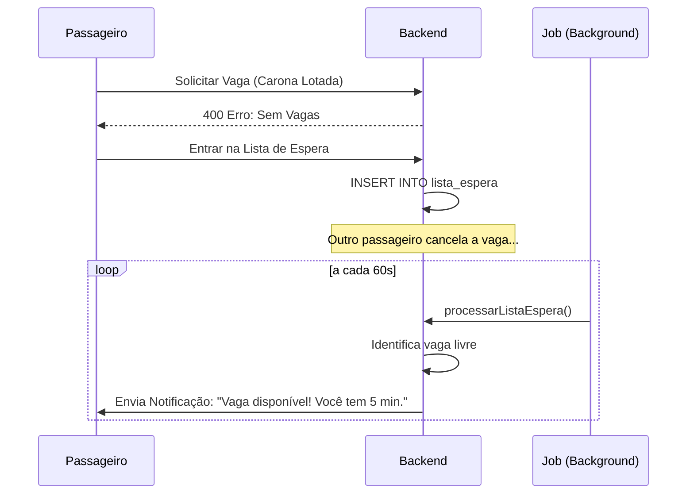
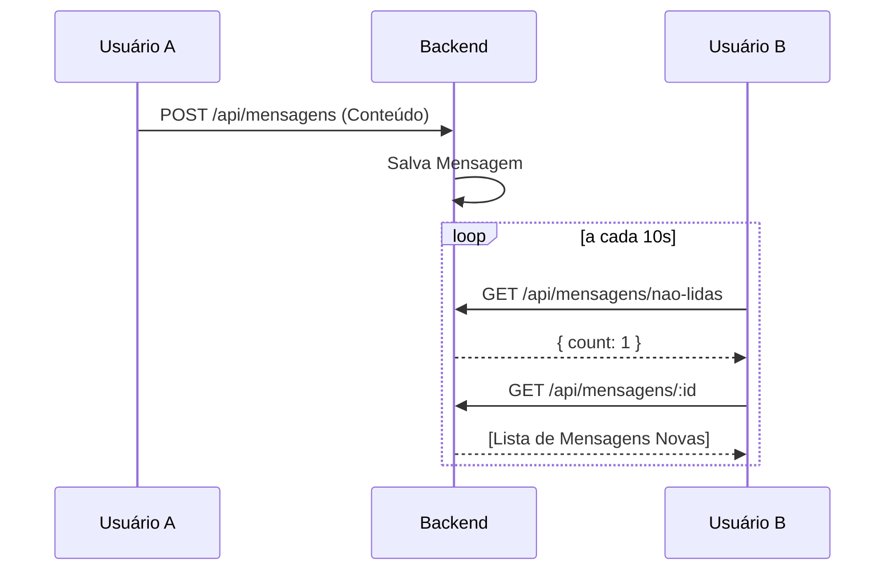

# Fluxos do Sistema 🔄

Este documento ilustra os principais fluxos operacionais do UniCaronas através de diagramas de sequência.

## 1. Fluxo de Autenticação e Cadastro
O cadastro exige o upload de documentos que serão validados posteriormente por um administrador.

## 2. Fluxo de Carona: Da Oferta ao Pagamento

## 3. Fluxo de Lista de Espera
Quando uma carona está lotada, o sistema gerencia uma fila automática.

## 4. Fluxo de Mensagens (Chat)
O chat utiliza **Polling** para garantir que as mensagens cheguem a ambos os lados.

